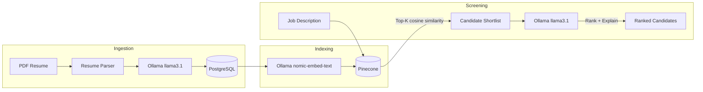

# Resume Screening Service

AI microservice (FastAPI) for a recruitment platform — resume parsing, candidate–job matching, and resume ranking.

## Architecture



## Features

| Module | Description |
|--------|-------------|
| **Resume Parsing** | PDF loader + LLM structured output (Pydantic) into PostgreSQL |
| **Candidate–Job Matching** | Resume/job embeddings in Pinecone, matched via cosine similarity |
| **Resume Ranking** | Hybrid retrieval — vector search narrows to top-K, then LLM ranks the shortlist |

## Prerequisites

- Python 3.11+
- [Ollama](https://ollama.com/) with `llama3.1` and `nomic-embed-text` models
- PostgreSQL
- Pinecone account and API key

## Quick Start

### 1. Start infrastructure

```bash
docker compose up -d
```

Pull Ollama models:

```bash
docker compose exec ollama ollama pull llama3.1
docker compose exec ollama ollama pull nomic-embed-text
```

On machines with limited memory, use the smaller local-development model:

```bash
docker compose exec ollama ollama pull llama3.2:3b
# Then set OLLAMA_LLM_MODEL=llama3.2:3b in .env
```

### 2. Configure environment

```bash
cp .env.example .env
# Edit .env and add your Pinecone API key.
```

The service reads `.env` through `pydantic-settings`. Keep `.env` private; it is
already excluded by `.gitignore`. The example file is safe to commit.

| Variable | Required? | Purpose |
|----------|-----------|---------|
| `APP_NAME` | No | Name displayed in the generated FastAPI documentation |
| `DEBUG` | No | Local-development debug flag |
| `DATABASE_URL` | Yes | SQLAlchemy connection URL for PostgreSQL |
| `OLLAMA_BASE_URL` | Yes | Address of the Ollama server |
| `OLLAMA_LLM_MODEL` | Yes | Chat model used to parse and evaluate resumes |
| `OLLAMA_EMBED_MODEL` | Yes | Embedding model used before Pinecone operations |
| `OLLAMA_NUM_CTX` | No | Maximum LLM context window used locally (default `2048`) |
| `OLLAMA_NUM_PREDICT` | No | Maximum generated tokens per LLM call (default `512`) |
| `PINECONE_API_KEY` | Yes | Secret API key; put the real value only in `.env` |
| `PINECONE_INDEX_NAME` | Yes | Vector index; it is created automatically with the embedding model's dimension if absent |
| `PINECONE_CLOUD` | Yes for a new index | Pinecone serverless cloud provider |
| `PINECONE_REGION` | Yes for a new index | Pinecone serverless region |
| `VECTOR_TOP_K` | No | Candidates retrieved by vector similarity (default `20`) |
| `RANKING_TOP_N` | No | Final candidates returned after LLM ranking (default `5`) |

When FastAPI runs on your computer while PostgreSQL and Ollama run through
Docker Compose, `127.0.0.1:5433` connects FastAPI to the Docker PostgreSQL
container. Port `5433` avoids conflicting with another PostgreSQL installation
on the standard host port `5432`.

Docker Ollama is published at `127.0.0.1:11435` to avoid conflicting with a
native Ollama installation that commonly uses port `11434`.

### 3. Install dependencies

```bash
python -m venv .venv
source .venv/bin/activate
pip install -e ".[dev]"
```

### 4. Run the service

```bash
uvicorn app.main:app --reload --port 8000
```

Open [http://localhost:8000/docs](http://localhost:8000/docs) for the interactive API docs.

## API Endpoints

| Method | Endpoint | Description |
|--------|----------|-------------|
| `POST` | `/api/v1/candidates/upload` | Upload PDF resume → parse → store → embed |
| `POST` | `/api/v1/candidates/` | Create candidate from JSON |
| `GET`  | `/api/v1/candidates/` | List all candidates |
| `POST` | `/api/v1/jobs/` | Create job posting → embed |
| `GET`  | `/api/v1/jobs/` | List all jobs |
| `POST` | `/api/v1/screening/rank` | Hybrid rank candidates for a job |
| `GET`  | `/health` | Health check |

## Example Workflow

```bash
# 1. Upload a resume
curl -X POST http://localhost:8000/api/v1/candidates/upload \
  -F "file=@resume.pdf"

# 2. Create a job posting
curl -X POST http://localhost:8000/api/v1/jobs/ \
  -H "Content-Type: application/json" \
  -d '{
    "title": "Senior Python Developer",
    "company": "Acme Corp",
    "description": "Build AI microservices with FastAPI and LangChain.",
    "required_skills": ["Python", "FastAPI", "PostgreSQL"],
    "preferred_skills": ["LangChain", "Pinecone", "Docker"]
  }'

# 3. Rank candidates for the job
curl -X POST http://localhost:8000/api/v1/screening/rank \
  -H "Content-Type: application/json" \
  -d '{"job_id": "<job-uuid>", "top_k": 20, "top_n": 5}'
```

## Project Structure

```
resume-screening-service/
├── app/
│   ├── main.py              # FastAPI entrypoint
│   ├── config.py            # Settings (Pydantic)
│   ├── database.py          # SQLAlchemy setup
│   ├── models/
│   │   ├── db.py            # SQLAlchemy ORM models
│   │   └── schemas.py       # Pydantic request/response schemas
│   ├── services/
│   │   ├── resume_parser.py # PDF → LLM structured output
│   │   ├── embeddings.py    # Pinecone vector store
│   │   ├── matching.py      # LLM match explanations
│   │   └── ranking.py       # Hybrid retrieval pipeline
│   ├── routers/
│   │   ├── candidates.py
│   │   ├── jobs.py
│   │   └── screening.py
│   └── llm/
│       └── ollama_client.py # LangChain Ollama wrappers
├── docker-compose.yml
├── pyproject.toml
└── .env.example
```

## Tech Stack

- **FastAPI** — async REST API
- **PostgreSQL + SQLAlchemy** — structured candidate/job records
- **Pinecone** — vector database for semantic search
- **LangChain + Ollama** — local LLM (`llama3.1`) and embeddings (`nomic-embed-text`)
- **Pydantic** — structured LLM output validation
