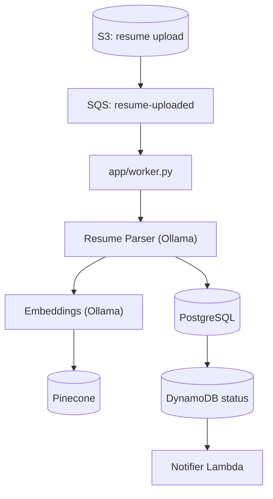
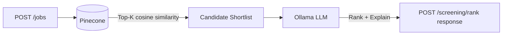

# Resume Screening Service

AI microservice (FastAPI) for a recruitment platform — resume parsing, candidate–job matching, and resume ranking.

## Architecture

Two independent pipelines. Resumes never arrive over this service's own API.

### 1. Ingestion pipeline — resume parsing

Event-driven, not API-driven. An upstream service publishes a
`resume-uploaded` event directly to an SQS queue — no SNS topic in front of
it, since fan-out to multiple consumers only pays off if there's more than
one, and this service is the only consumer. This service's worker
(`app/worker.py`) consumes it, parses the PDF via Ollama, stores it in
PostgreSQL, and embeds it in Pinecone. See
[docs/terraform-sqs-explained.md](docs/terraform-sqs-explained.md) for why
this uses plain SQS, not SNS fan-out.



Run it locally with:

```bash
python -m app.worker
```

Needs `SQS_QUEUE_URL`, `S3_BUCKET_NAME`, `DYNAMODB_TABLE_NAME`, and
`AWS_REGION` set (see `.env.example`). A successful parse writes
`status: ai-processed` to DynamoDB for a downstream notification loop.

### 2. Screening pipeline — matching & ranking

API-driven — the two endpoints this service exposes:

| Method | Endpoint | Description |
|--------|----------|-------------|
| `POST` | `/api/v1/jobs/` | Create job posting → embed |
| `POST` | `/api/v1/screening/rank` | Hybrid rank candidates for a job |

Plus `GET /health` for liveness/readiness checks. (A few other routes —
`GET /api/v1/jobs/`, candidate CRUD under `/api/v1/candidates/` — still
exist in the code for manual/dev testing, but aren't part of the intended
two-pipeline architecture and aren't documented as a stable public API.)



```bash
# 1. Create a job posting
curl -X POST http://localhost:8000/api/v1/jobs/ \
  -H "Content-Type: application/json" \
  -d '{
    "title": "Senior Python Developer",
    "company": "Acme Corp",
    "description": "Build AI microservices with FastAPI and LangChain.",
    "required_skills": ["Python", "FastAPI", "PostgreSQL"],
    "preferred_skills": ["LangChain", "Pinecone", "Docker"]
  }'

# 2. Rank candidates for the job
curl -X POST http://localhost:8000/api/v1/screening/rank \
  -H "Content-Type: application/json" \
  -d '{"job_id": "<job-uuid>", "top_k": 20, "top_n": 5}'
```

## Features

| Module | Description |
|--------|-------------|
| **Resume Parsing** | PDF loader + LLM structured output (Pydantic) into PostgreSQL |
| **Candidate–Job Matching** | Resume/job embeddings in Pinecone, matched via cosine similarity |
| **Resume Ranking** | Hybrid retrieval — vector search narrows to top-K, then LLM ranks the shortlist |

## Prerequisites

- Docker + Docker Compose
- Pinecone account and API key
- Python 3.11+ — only needed for the [native, non-Docker run path](#alternative-run-natively-without-docker)

## Quick Start

### 1. Configure environment

```bash
cp .env.example .env
# Edit .env and add your Pinecone API key.
```

The service reads `.env` through `pydantic-settings`. Keep `.env` private; it is
already excluded by `.gitignore`. The example file is safe to commit.
`docker compose` also loads this file directly — it must exist before step 2.

| Variable | Required? | Purpose |
|----------|-----------|---------|
| `APP_NAME` | No | Name displayed in the generated FastAPI documentation |
| `DEBUG` | No | Local-development debug flag |
| `DATABASE_URL` | Yes | SQLAlchemy connection URL for PostgreSQL |
| `OLLAMA_BASE_URL` | Yes | Address of the Ollama server |
| `OLLAMA_LLM_MODEL` | Yes | Chat model used to parse and evaluate resumes |
| `OLLAMA_EMBED_MODEL` | Yes | Embedding model used before Pinecone operations |
| `OLLAMA_NUM_CTX` | No | Maximum LLM context window used locally (default `2048`) |
| `OLLAMA_NUM_PREDICT` | No | Maximum generated tokens per LLM call (default `768`) |
| `PINECONE_API_KEY` | Yes | Secret API key; put the real value only in `.env` |
| `PINECONE_INDEX_NAME` | Yes | Vector index; it is created automatically with the embedding model's dimension if absent |
| `PINECONE_CLOUD` | Yes for a new index | Pinecone serverless cloud provider |
| `PINECONE_REGION` | Yes for a new index | Pinecone serverless region |
| `VECTOR_TOP_K` | No | Candidates retrieved by vector similarity (default `20`) |
| `RANKING_TOP_N` | No | Final candidates returned after LLM ranking (default `5`) |
| `AWS_REGION`, `SQS_QUEUE_URL`, `S3_BUCKET_NAME`, `DYNAMODB_TABLE_NAME` | Only for the worker | Real AWS resources the ingestion pipeline consumes — see `infra/terraform/` |

Note: outside Docker, `127.0.0.1:5433`/`127.0.0.1:11435` (the values in
`.env.example`) reach Postgres/Ollama through their Compose port mappings.
Inside Docker, `docker-compose.yml` overrides these to the in-network
service names (`postgres:5432`, `ollama:11434`) automatically — no `.env`
changes needed either way.

### 2. Start everything

```bash
docker compose up -d --build
```

One command brings up all four services: `postgres`, `ollama`, `api`
(runs `alembic upgrade head` automatically, then serves on `:8000`), and
`worker` (waits for `api` to be healthy, then starts polling SQS). No
separate migration step needed for this path.

Pull the Ollama models the first time:

```bash
docker compose exec ollama ollama pull llama3.2:3b
docker compose exec ollama ollama pull nomic-embed-text
```

`llama3.2:3b` is the default — small enough to run comfortably in Docker
Desktop's default memory allocation. For better extraction quality on a
machine with more RAM to spare, `llama3.1` (8B) works too — pull it and set
`OLLAMA_LLM_MODEL=llama3.1` in `.env`, then `docker compose up -d --build`
again.

Confirm it's healthy:

```bash
curl localhost:8000/health
```

The `worker` container needs real `SQS_QUEUE_URL`/`S3_BUCKET_NAME` values
(and AWS credentials — it mounts `~/.aws` read-only) to do anything useful;
without them it just idles. The screening API and JSON-based candidate
creation work regardless.

### Alternative: run natively, without Docker

Useful for hot-reload development. Postgres and Ollama still run via
Compose (`docker compose up -d postgres ollama`); `api`/`worker` run
directly on the host, using the `127.0.0.1` values already in `.env.example`.

1. Install dependencies:
   ```bash
   python -m venv .venv
   source .venv/bin/activate
   pip install -e ".[dev]"
   ```
2. Apply database migrations:
   ```bash
   alembic upgrade head
   ```
   The app doesn't create its own tables on startup — schema is owned by
   Alembic (`alembic/versions/`), applied explicitly. See
   [docs/alembic-migrations-explained.md](docs/alembic-migrations-explained.md).
3. Run the service:
   ```bash
   uvicorn app.main:app --reload --port 8000
   ```

Open [http://localhost:8000/docs](http://localhost:8000/docs) for the interactive API docs.

See [Architecture](#architecture) above for the two pipelines, their
endpoints/entry points, and example requests.

## Deployment

- **`Dockerfile`** — multi-stage build; one image serves both the API
  (default `CMD`, which runs migrations then `uvicorn`) and the worker
  (`command: python -m app.worker` override in `docker-compose.yml`).
- **`docker-compose.yml`** — the full local stack: `postgres`, `ollama`,
  `api`, `worker`. `api`/`worker` use `build: .` here, for instant rebuilds
  during development.
- **`docker-compose.prod.yml`** — override used only by the CD job below;
  swaps `build: .` for `image: ghcr.io/...` so it runs exactly what CI built,
  never a local rebuild.
- **`.github/workflows/ci.yml`** — three jobs: `lint-and-test`, then
  `build-and-push` (image to GHCR, on merges to `main` only), then `deploy`
  — which runs on a **self-hosted GitHub Actions runner** (installed on the
  machine actually running the app) and does
  `docker compose -f docker-compose.yml -f docker-compose.prod.yml pull && up -d`.
  That job intentionally only ever triggers on push-to-`main` (inherited via
  `needs:`), never `pull_request` — a self-hosted runner reachable from a
  fork's PR would let a stranger run code on that machine.
- **`infra/terraform/`** — IaC for the DynamoDB table (with streams enabled),
  the notifier Lambda that reacts to status changes, the SQS queue the
  worker consumes, and the worker's IAM permissions. Currently destroyed
  (not applied) — `terraform apply` recreates them when needed.
- **Metrics** — `GET /metrics` on the API (`prometheus-fastapi-instrumentator`)
  and on the worker's own port (`WORKER_METRICS_PORT`, default `9100`),
  custom counters/histograms for message outcomes and processing time.

## Documentation

Learning notes written while building out the deployment pipeline above,
explaining each file in plain language:

- [docs/ci-cd-explained.md](docs/ci-cd-explained.md) — the GitHub Actions
  workflow, including real failures hit and fixed on its first live run
- [docs/terraform-dynamodb-lambda-explained.md](docs/terraform-dynamodb-lambda-explained.md) —
  `infra/terraform/`, the DynamoDB Streams + Lambda pattern, file by file
- [docs/terraform-sqs-explained.md](docs/terraform-sqs-explained.md) — the
  worker's SQS queue and IAM permissions, and why this uses plain SQS instead of SNS fan-out
- [docs/testing-explained.md](docs/testing-explained.md) — the pytest suite:
  real-Postgres + SAVEPOINT test isolation, and where each mock is patched and why
- [docs/alembic-migrations-explained.md](docs/alembic-migrations-explained.md) —
  adopting Alembic on an already-existing database, and how it's wired to the app's own settings
- [docs/observability-explained.md](docs/observability-explained.md) — the
  Prometheus instrumentation on both the API and worker, verified with real `curl` output

## Project Structure

```
resume-screening-service/
├── app/
│   ├── main.py              # FastAPI entrypoint
│   ├── config.py            # Settings (Pydantic)
│   ├── database.py          # SQLAlchemy setup
│   ├── worker.py            # SQS consumer (event-driven ingestion)
│   ├── models/
│   │   ├── db.py            # SQLAlchemy ORM models
│   │   └── schemas.py       # Pydantic request/response schemas
│   ├── services/
│   │   ├── resume_parser.py # PDF → LLM structured output
│   │   ├── embeddings.py    # Pinecone vector store
│   │   ├── matching.py      # LLM match explanations
│   │   └── ranking.py       # Hybrid retrieval pipeline
│   ├── repositories/
│   │   ├── candidate_repository.py
│   │   └── job_repository.py
│   ├── routers/
│   │   ├── candidates.py
│   │   ├── jobs.py
│   │   └── screening.py
│   └── llm/
│       └── ollama_client.py # LangChain Ollama wrappers
├── alembic/versions/                 # DB schema migrations
├── alembic.ini
├── .github/workflows/ci.yml          # CI + self-hosted-runner CD
├── infra/terraform/                  # DynamoDB, notifier Lambda, SQS, worker IAM
├── tests/                            # pytest, happy-path (see docs)
├── docs/                             # Learning notes (see above)
├── docker-compose.yml                # Full local stack: postgres, ollama, api, worker
├── docker-compose.prod.yml           # Image-source override, used by the CD job only
├── Dockerfile
├── pyproject.toml
└── .env.example
```

## Tech Stack

- **FastAPI** — async REST API
- **PostgreSQL + SQLAlchemy + Alembic** — structured candidate/job records, schema managed via migrations
- **Pinecone** — vector database for semantic search
- **LangChain + Ollama** — local LLM (default `llama3.2:3b`) and embeddings (`nomic-embed-text`)
- **Pydantic** — structured LLM output validation
- **Docker Compose** — the active runtime: `postgres`, `ollama`, `api`, `worker`
- **GitHub Actions** — CI (lint, test, build, push to GHCR) and CD (self-hosted
  runner deploys via Compose) — see [Deployment](#deployment) above
- **AWS (SQS, DynamoDB, Lambda, S3, IAM)** — the event-driven ingestion pipeline, via Terraform
- **Prometheus** — metrics on both the API and worker
