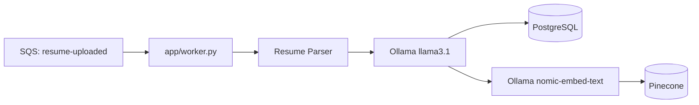
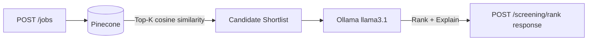

# Resume Screening Service

AI microservice (FastAPI) for a recruitment platform — resume parsing, candidate–job matching, and resume ranking.

## Architecture

Two independent pipelines. Resumes never arrive over this service's own API
— see the [full integration diagram](https://claude.ai/code/artifact/74a361da-b5d2-499a-acea-4bba94496ec6)
for the complete picture including the upstream S3/SNS/SQS/DynamoDB pieces.

### 1. Ingestion pipeline — resume parsing

Event-driven, not API-driven. An upstream service publishes a
`resume-uploaded` event → SNS → SQS → this service's worker
(`app/worker.py`) consumes it, parses the PDF via Ollama, stores it in
PostgreSQL, and embeds it in Pinecone.



Run it locally with:

```bash
python -m app.worker
```

Needs `SQS_QUEUE_URL`, `S3_BUCKET_NAME`, `DYNAMODB_TABLE_NAME`, and
`AWS_REGION` set (see `.env.example`). A successful parse writes
`status: ai-processed` to DynamoDB for a downstream notification loop.

### 2. Screening pipeline — matching & ranking

API-driven — the two endpoints this service exposes:

| Method | Endpoint | Description |
|--------|----------|-------------|
| `POST` | `/api/v1/jobs/` | Create job posting → embed |
| `POST` | `/api/v1/screening/rank` | Hybrid rank candidates for a job |

Plus `GET /health` for liveness/readiness checks. (A few other routes —
`GET /api/v1/jobs/`, candidate CRUD under `/api/v1/candidates/` — still
exist in the code for manual/dev testing, but aren't part of the intended
two-pipeline architecture and aren't documented as a stable public API.)



```bash
# 1. Create a job posting
curl -X POST http://localhost:8000/api/v1/jobs/ \
  -H "Content-Type: application/json" \
  -d '{
    "title": "Senior Python Developer",
    "company": "Acme Corp",
    "description": "Build AI microservices with FastAPI and LangChain.",
    "required_skills": ["Python", "FastAPI", "PostgreSQL"],
    "preferred_skills": ["LangChain", "Pinecone", "Docker"]
  }'

# 2. Rank candidates for the job
curl -X POST http://localhost:8000/api/v1/screening/rank \
  -H "Content-Type: application/json" \
  -d '{"job_id": "<job-uuid>", "top_k": 20, "top_n": 5}'
```

## Features

| Module | Description |
|--------|-------------|
| **Resume Parsing** | PDF loader + LLM structured output (Pydantic) into PostgreSQL |
| **Candidate–Job Matching** | Resume/job embeddings in Pinecone, matched via cosine similarity |
| **Resume Ranking** | Hybrid retrieval — vector search narrows to top-K, then LLM ranks the shortlist |

## Prerequisites

- Python 3.11+
- [Ollama](https://ollama.com/) with `llama3.1` and `nomic-embed-text` models
- PostgreSQL
- Pinecone account and API key

## Quick Start

### 1. Start infrastructure

```bash
docker compose up -d
```

Pull Ollama models:

```bash
docker compose exec ollama ollama pull llama3.1
docker compose exec ollama ollama pull nomic-embed-text
```

On machines with limited memory, use the smaller local-development model:

```bash
docker compose exec ollama ollama pull llama3.2:3b
# Then set OLLAMA_LLM_MODEL=llama3.2:3b in .env
```

### 2. Configure environment

```bash
cp .env.example .env
# Edit .env and add your Pinecone API key.
```

The service reads `.env` through `pydantic-settings`. Keep `.env` private; it is
already excluded by `.gitignore`. The example file is safe to commit.

| Variable | Required? | Purpose |
|----------|-----------|---------|
| `APP_NAME` | No | Name displayed in the generated FastAPI documentation |
| `DEBUG` | No | Local-development debug flag |
| `DATABASE_URL` | Yes | SQLAlchemy connection URL for PostgreSQL |
| `OLLAMA_BASE_URL` | Yes | Address of the Ollama server |
| `OLLAMA_LLM_MODEL` | Yes | Chat model used to parse and evaluate resumes |
| `OLLAMA_EMBED_MODEL` | Yes | Embedding model used before Pinecone operations |
| `OLLAMA_NUM_CTX` | No | Maximum LLM context window used locally (default `2048`) |
| `OLLAMA_NUM_PREDICT` | No | Maximum generated tokens per LLM call (default `512`) |
| `PINECONE_API_KEY` | Yes | Secret API key; put the real value only in `.env` |
| `PINECONE_INDEX_NAME` | Yes | Vector index; it is created automatically with the embedding model's dimension if absent |
| `PINECONE_CLOUD` | Yes for a new index | Pinecone serverless cloud provider |
| `PINECONE_REGION` | Yes for a new index | Pinecone serverless region |
| `VECTOR_TOP_K` | No | Candidates retrieved by vector similarity (default `20`) |
| `RANKING_TOP_N` | No | Final candidates returned after LLM ranking (default `5`) |

When FastAPI runs on your computer while PostgreSQL and Ollama run through
Docker Compose, `127.0.0.1:5433` connects FastAPI to the Docker PostgreSQL
container. Port `5433` avoids conflicting with another PostgreSQL installation
on the standard host port `5432`.

Docker Ollama is published at `127.0.0.1:11435` to avoid conflicting with a
native Ollama installation that commonly uses port `11434`.

### 3. Install dependencies

```bash
python -m venv .venv
source .venv/bin/activate
pip install -e ".[dev]"
```

### 4. Apply database migrations

```bash
alembic upgrade head
```

The app no longer creates its own tables on startup — schema is owned by
Alembic (`alembic/versions/`), applied explicitly. See
[docs/alembic-migrations-explained.md](docs/alembic-migrations-explained.md).

### 5. Run the service

```bash
uvicorn app.main:app --reload --port 8000
```

Open [http://localhost:8000/docs](http://localhost:8000/docs) for the interactive API docs.

See [Architecture](#architecture) above for the two pipelines, their
endpoints/entry points, and example requests.

## Deployment

- **`Dockerfile`** — multi-stage build; one image serves both the API
  (default `CMD`) and the worker (`command: ["python", "-m", "app.worker"]`
  override in the Helm chart).
- **`charts/resume-screening-service/`** — Helm chart for API + worker
  Deployments, a Service, ConfigMap/Secret, and an optional
  CPU-based HPA.
- **`.github/workflows/ci.yml`** — lint, test, then build + push the image
  to GHCR on merges to `main`. Never deploys anything itself.
- **`argocd/application.yaml`** — GitOps: ArgoCD watches this repo's chart
  and syncs the cluster to match it, rather than CI pushing changes out.
- **`infra/terraform/`** — the DynamoDB table (with streams enabled) and
  the notifier Lambda that reacts to status changes, as IaC.

## Documentation

Learning notes written while building out the deployment pipeline above,
explaining each file in plain language:

- [docs/helm-chart-explained.md](docs/helm-chart-explained.md) — every file
  in the Helm chart, piece by piece
- [docs/ci-cd-explained.md](docs/ci-cd-explained.md) — the GitHub Actions
  workflow, including real failures hit and fixed on its first live run
- [docs/argocd-explained.md](docs/argocd-explained.md) — `argocd/application.yaml`
  explained, plus notes from actually installing ArgoCD and watching it sync
- [docs/terraform-dynamodb-lambda-explained.md](docs/terraform-dynamodb-lambda-explained.md) —
  `infra/terraform/`, the DynamoDB Streams + Lambda pattern, file by file
- [docs/testing-explained.md](docs/testing-explained.md) — the pytest suite:
  real-Postgres + SAVEPOINT test isolation, and where each mock is patched and why
- [docs/alembic-migrations-explained.md](docs/alembic-migrations-explained.md) —
  adopting Alembic on an already-existing database, and how it's wired to the app's own settings
- [Event-driven integration architecture](https://claude.ai/code/artifact/74a361da-b5d2-499a-acea-4bba94496ec6) —
  diagram of the full upload → worker → data stores → screening pipeline

## Project Structure

```
resume-screening-service/
├── app/
│   ├── main.py              # FastAPI entrypoint
│   ├── config.py            # Settings (Pydantic)
│   ├── database.py          # SQLAlchemy setup
│   ├── worker.py            # SQS consumer (event-driven ingestion)
│   ├── models/
│   │   ├── db.py            # SQLAlchemy ORM models
│   │   └── schemas.py       # Pydantic request/response schemas
│   ├── services/
│   │   ├── resume_parser.py # PDF → LLM structured output
│   │   ├── embeddings.py    # Pinecone vector store
│   │   ├── matching.py      # LLM match explanations
│   │   └── ranking.py       # Hybrid retrieval pipeline
│   ├── repositories/
│   │   ├── candidate_repository.py
│   │   └── job_repository.py
│   ├── routers/
│   │   ├── candidates.py
│   │   ├── jobs.py
│   │   └── screening.py
│   └── llm/
│       └── ollama_client.py # LangChain Ollama wrappers
├── alembic/versions/                 # DB schema migrations
├── alembic.ini
├── charts/resume-screening-service/  # Helm chart
├── .github/workflows/ci.yml          # CI
├── argocd/application.yaml           # GitOps Application
├── infra/terraform/                  # DynamoDB + notifier Lambda
├── tests/                            # pytest, happy-path (see docs)
├── docs/                             # Learning notes (see above)
├── docker-compose.yml
├── Dockerfile
├── pyproject.toml
└── .env.example
```

## Tech Stack

- **FastAPI** — async REST API
- **PostgreSQL + SQLAlchemy + Alembic** — structured candidate/job records, schema managed via migrations
- **Pinecone** — vector database for semantic search
- **LangChain + Ollama** — local LLM (`llama3.1`) and embeddings (`nomic-embed-text`)
- **Pydantic** — structured LLM output validation
- **Docker, Helm, GitHub Actions, ArgoCD, Terraform** — containerization and
  deployment pipeline (see [Deployment](#deployment) above)
