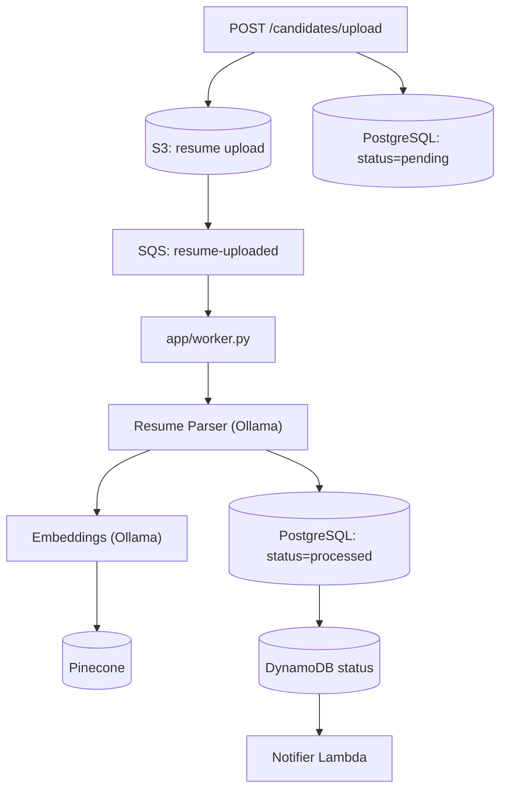

# Resume Screening Service

AI microservice (FastAPI) for a recruitment platform — resume parsing, candidate–job matching, and resume ranking.

## Architecture

Two pipelines, both now owned end-to-end by this service.

### 1. Ingestion pipeline — resume upload & parsing

`POST /api/v1/candidates/upload` (`app/routers/candidates.py`) is the
producer: it creates a `pending` `Candidate` row, uploads the raw PDF to
S3, and publishes a `resume-uploaded` message to SQS
(`app/services/ingestion.py`) — no SNS topic in front of it, since fan-out
to multiple consumers only pays off if there's more than one, and this
service is the only consumer. It returns immediately (202) with the
candidate's id; there's no LLM call in that request.

This service's own worker (`app/worker.py`) is the consumer: it reads the
message, downloads the PDF from S3, parses it via Ollama, and updates the
*same* `Candidate` row in place (`pending` → `processing` → `processed`,
or `failed` on a permanent parse error), then embeds it in Pinecone. A
client polls `GET /api/v1/candidates/{id}` and watches `status` to know
when it's done. See
[docs/terraform-sqs-explained.md](docs/terraform-sqs-explained.md) for why
this uses plain SQS, not SNS fan-out.


```mermaid
flowchart TD
    Upload["POST /candidates/upload"] --> S3[(S3: resume upload)]
    Upload --> PGPending[(PostgreSQL: status=pending)]
    S3 --> SQS[SQS: resume-uploaded]
    SQS --> Worker[app/worker.py]
    Worker --> Parser["Resume Parser (Ollama)"]
    Parser --> PG[(PostgreSQL: status=processed)]
    Parser --> Embed["Embeddings (Ollama)"]
    Embed --> PC[(Pinecone)]
    PG --> DDB[(DynamoDB status)]
    DDB --> Lambda[Notifier Lambda]
```

Run the worker locally with:

```bash
python -m app.worker
```

Needs `SQS_QUEUE_URL`, `S3_BUCKET_NAME`, `DYNAMODB_TABLE_NAME`, and
`AWS_REGION` set (see `.env.example`) — the same variables the upload
endpoint reads, since this service is now both producer and consumer of
its own queue.

### 2. Screening pipeline — matching & ranking

API-driven:

| Method | Endpoint | Description |
|--------|----------|-------------|
| `POST` | `/api/v1/jobs/` | Create job posting → embed |
| `POST` | `/api/v1/candidates/upload` | Enqueue a resume for async parsing (202, `status: pending`) |
| `GET` | `/api/v1/candidates/{id}` | Poll parsing status / fetch a parsed candidate |
| `POST` | `/api/v1/screening/rank` | Hybrid rank candidates for a job |

Plus `GET /health` for liveness/readiness checks. (`GET /api/v1/jobs/` and
the JSON-body `POST /api/v1/candidates/` still exist for manual/dev
testing, but aren't documented as a stable public API.)


```mermaid
flowchart LR
    JD["POST /jobs"] --> PC[(Pinecone)]
    PC -->|Top-K cosine similarity| Shortlist[Candidate Shortlist]
    Shortlist --> LLM2[Ollama LLM]
    LLM2 -->|Rank + Explain| Results["POST /screening/rank response"]
```

Every `/api/v1/*` request needs an `X-API-Key` header for a real,
non-revoked key (see [Authentication and multi-tenancy](#authentication-and-multi-tenancy)
below) - `/health` and `/metrics` are the only routes that don't. There's
no tenant/key-creation endpoint yet, so `$API_KEY` below stands in for a
key you've inserted directly into the `api_keys` table for now.

```bash
# 1. Create a job posting
curl -X POST http://localhost:8000/api/v1/jobs/ \
  -H "Content-Type: application/json" \
  -H "X-API-Key: $API_KEY" \
  -d '{
    "title": "Senior Python Developer",
    "company": "Acme Corp",
    "description": "Build AI microservices with FastAPI and LangChain.",
    "required_skills": ["Python", "FastAPI", "PostgreSQL"],
    "preferred_skills": ["LangChain", "Pinecone", "Docker"]
  }'

# 2. Rank candidates for the job
curl -X POST http://localhost:8000/api/v1/screening/rank \
  -H "Content-Type: application/json" \
  -H "X-API-Key: $API_KEY" \
  -d '{"job_id": "<job-uuid>", "top_k": 20, "top_n": 5}'
```

## Authentication and multi-tenancy

Every route under `/api/v1/` (jobs, candidates, screening) requires a
matching `X-API-Key` header, resolved to a `tenant_id` by
[`app/auth.py`](app/auth.py)'s `require_api_key` dependency - every handler
receives that `tenant_id` and every query is scoped by it, so one tenant's
jobs/candidates are invisible to every other tenant (see
[`tests/test_tenancy.py`](tests/test_tenancy.py)). `GET /health` and
`GET /metrics` are intentionally exempt - Docker's healthcheck and a
Prometheus scrape config would otherwise need a key too.

**Keys, not passwords**: only a SHA-256 hash of each key is stored
(`api_keys.hashed_key`) - the raw key is shown exactly once, at creation,
and is never retrievable again. There's no shared/global key anymore; every
tenant has their own, and revoking one (`api_keys.revoked_at`) doesn't
affect any other tenant.

**Fails closed**: an empty `api_keys` table, an unrecognized key, or a
revoked key are all indistinguishable to a caller - every one of them is a
401. There's no "unconfigured" state that falls open.

Tenant and API-key management has no dedicated endpoint yet in this
service - see the admin API work tracked for that.

## Features

| Module | Description |
|--------|-------------|
| **Resume Parsing** | PDF loader + LLM structured output (Pydantic) into PostgreSQL |
| **Candidate–Job Matching** | Resume/job embeddings in Pinecone, matched via cosine similarity |
| **Resume Ranking** | Hybrid retrieval — vector search narrows to top-K, then LLM ranks the shortlist |

## AI techniques used

**Type of AI**: locally-hosted, open-weight LLMs via [Ollama](https://ollama.com/)
— `llama3.2:3b` for language tasks, `nomic-embed-text` for embeddings — not a
hosted API like OpenAI or Anthropic. The whole pipeline runs on a laptop, no
per-token cost, no data leaving the machine.

**This is not agentic AI**, and that's a deliberate distinction, not an
omission. Nothing here autonomously plans multi-step actions, decides which
tool to call, or runs in a reasoning loop (no LangGraph, no `AgentExecutor`,
no tool-calling). Every LLM call is a single, direct request: parse this
text, score this candidate. What's actually implemented:

1. **Structured output extraction** (`app/services/resume_parser.py`) —
   LangChain's `with_structured_output` forces the LLM's response into a
   strict Pydantic schema (`ParsedResume`), turning freeform resume text
   into valid, typed JSON reliably, not just "usually."
2. **RAG-style hybrid retrieval + LLM re-ranking** (`app/services/ranking.py`,
   `matching.py`) — Pinecone vector search narrows a job's candidate pool to
   the top-K by cosine similarity (cheap), then the LLM evaluates each
   shortlisted candidate individually — structured score, strengths, gaps,
   summary — and results are re-sorted by that score (expensive, but only
   on the shortlist). Retrieve cheap, reason expensive on the narrowed set —
   a standard, real production RAG pattern.
3. **Prompting a small local model reliably** — `llama3.2:3b` initially
   dropped the summary/experience-description fields during extraction even
   when present in the source text; fixed by making the prompt explicitly
   call out fields the model tends to skip. A concrete, real example of the
   gap between "a bigger hosted model would probably just get this right"
   and what it actually takes to get consistent structured output from a
   small local one.
4. **Concurrent ranking, not sequential** (`app/services/ranking.py`) — the
   per-candidate LLM call in `rank_candidates_for_job()` used to run one
   candidate at a time, so ranking the default `top_k=20` shortlist meant 20
   back-to-back local-model generations before a response went out. Local
   open-weight models trade per-token cost for raw speed, and a synchronous
   API endpoint can't hide that latency the way the event-driven ingestion
   pipeline already does. Candidates are now evaluated with a
   `ThreadPoolExecutor` (`RANKING_CONCURRENCY`, default `5`), while the
   SQLAlchemy session itself stays single-threaded — only the DB-free LLM
   calls run in parallel. This only pays off if Ollama is actually
   configured to process that many requests at once (`OLLAMA_NUM_PARALLEL`
   on the Ollama server); otherwise it just queues them at the same total
   cost, same total time.

## Embeddings and vector search (Pinecone)

**Model**: `nomic-embed-text` via Ollama — 768-dimensional embeddings,
generated locally, no external embedding API. The Pinecone index name
(`resume-screening-nomic-768`) bakes in the dimension on purpose, as a
reminder that an index is permanently tied to one embedding
dimension/model.

**What actually gets embedded** — not raw PDF text. `build_candidate_embed_text()`
/ `build_job_embed_text()` (`app/services/ranking.py`) assemble a plain-text
summary from the already-*parsed*, structured fields first (name, summary,
skills, each job's title/company/description, education) — the vector
reflects clean structured data, not noisy raw resume text.

**Index management** (`app/services/embeddings.py`, `VectorStore`):
- Lazily initialized — the Pinecone client and index handle are only
  created on first real use, not at import time.
- **Self-sizing index creation**: if the configured index doesn't exist
  yet, it's created automatically with `metric="cosine"` on Pinecone
  Serverless — and its dimension isn't hardcoded, it's measured by
  actually embedding a probe string first. That avoids a real class of
  bug: an index created with the wrong dimension for whatever embedding
  model is actually configured.

**Candidates and jobs share one index**, distinguished by metadata rather
than separate Pinecone indexes or namespaces:
- Vector IDs: `candidate-{uuid}` / `job-{uuid}`
- Metadata carries `type: "candidate" | "job"`
- `query_similar_candidates()` explicitly filters on `type: candidate`, so
  a job's query never accidentally matches against other jobs even though
  they live in the same index.

**Where it's used**:
1. **On creation** — every candidate (`candidate_service.py`) and job
   (`job_service.py`) gets embedded and upserted immediately, in the same
   flow as the database write; a Pinecone failure rolls back the
   Postgres write too (`VectorIndexingError`), so the two never drift out
   of sync.
2. **On screening** (`ranking.py` `rank_candidates_for_job`) — the job's
   text is embedded once and used as the query vector; Pinecone's top-K
   nearest neighbors (cosine similarity) become the shortlist the LLM then
   re-ranks — the hybrid retrieval pattern described above.

**Verified against a real index, not a mock**: `describe_index_stats()`
returned `dimension=768, metric='cosine'`, and every Postgres candidate row
with a `pinecone_id` set had exactly one matching real vector — confirmed
by cross-referencing the two directly, not assumed.

## Prerequisites

- Docker + Docker Compose
- Pinecone account and API key
- Python 3.11+ — only needed for the [native, non-Docker run path](#alternative-run-natively-without-docker)

## Quick Start

### 1. Configure environment

```bash
cp .env.example .env
# Edit .env and add your Pinecone API key.
```

The service reads `.env` through `pydantic-settings`. Keep `.env` private; it is
already excluded by `.gitignore`. The example file is safe to commit.
`docker compose` also loads this file directly — it must exist before step 2.

| Variable | Required? | Purpose |
|----------|-----------|---------|
| `APP_NAME` | No | Name displayed in the generated FastAPI documentation |
| `DEBUG` | No | Local-development debug flag |
| — | | Per-tenant API keys are stored in the `api_keys` table, not an env var — see [Authentication and multi-tenancy](#authentication-and-multi-tenancy) |
| `DATABASE_URL` | Yes | SQLAlchemy connection URL for PostgreSQL |
| `OLLAMA_BASE_URL` | Yes | Address of the Ollama server |
| `OLLAMA_LLM_MODEL` | Yes | Chat model used to parse and evaluate resumes |
| `OLLAMA_EMBED_MODEL` | Yes | Embedding model used before Pinecone operations |
| `OLLAMA_NUM_CTX` | No | Maximum LLM context window used locally (default `2048`) |
| `OLLAMA_NUM_PREDICT` | No | Maximum generated tokens per LLM call (default `768`) |
| `PINECONE_API_KEY` | Yes | Secret API key; put the real value only in `.env` |
| `PINECONE_INDEX_NAME` | Yes | Vector index; it is created automatically with the embedding model's dimension if absent |
| `PINECONE_CLOUD` | Yes for a new index | Pinecone serverless cloud provider |
| `PINECONE_REGION` | Yes for a new index | Pinecone serverless region |
| `VECTOR_TOP_K` | No | Candidates retrieved by vector similarity (default `20`) |
| `RANKING_TOP_N` | No | Final candidates returned after LLM ranking (default `5`) |
| `RANKING_CONCURRENCY` | No | Candidate LLM evaluations run concurrently per `/screening/rank` call (default `5`) — only actually parallelizes if Ollama's `OLLAMA_NUM_PARALLEL` (set on the Ollama server/container, not this app) is at least this high; otherwise Ollama just queues the extra requests |
| `AWS_REGION`, `SQS_QUEUE_URL`, `S3_BUCKET_NAME`, `DYNAMODB_TABLE_NAME` | Only for the worker | Real AWS resources the ingestion pipeline consumes — see `infra/terraform/` |

Note: outside Docker, `127.0.0.1:5433`/`127.0.0.1:11435` (the values in
`.env.example`) reach Postgres/Ollama through their Compose port mappings.
Inside Docker, `docker-compose.yml` overrides these to the in-network
service names (`postgres:5432`, `ollama:11434`) automatically — no `.env`
changes needed either way.

### 2. Start everything

```bash
docker compose up -d --build
```

One command brings up all four services: `postgres`, `ollama`, `api`
(runs `alembic upgrade head` automatically, then serves on `:8000`), and
`worker` (waits for `api` to be healthy, then starts polling SQS). No
separate migration step needed for this path.

Pull the Ollama models the first time:

```bash
docker compose exec ollama ollama pull llama3.2:3b
docker compose exec ollama ollama pull nomic-embed-text
```

`llama3.2:3b` is the default — small enough to run comfortably in Docker
Desktop's default memory allocation. For better extraction quality on a
machine with more RAM to spare, `llama3.1` (8B) works too — pull it and set
`OLLAMA_LLM_MODEL=llama3.1` in `.env`, then `docker compose up -d --build`
again.

Confirm it's healthy:

```bash
curl localhost:8000/health
```

The `worker` container needs real `SQS_QUEUE_URL`/`S3_BUCKET_NAME` values
(and AWS credentials — it mounts `~/.aws` read-only) to do anything useful;
without them it just idles. The screening API and JSON-based candidate
creation work regardless.

### Alternative: run natively, without Docker

Useful for hot-reload development. Postgres and Ollama still run via
Compose (`docker compose up -d postgres ollama`); `api`/`worker` run
directly on the host, using the `127.0.0.1` values already in `.env.example`.

1. Install dependencies:
   ```bash
   python -m venv .venv
   source .venv/bin/activate
   pip install -e ".[dev]"
   ```
2. Apply database migrations:
   ```bash
   alembic upgrade head
   ```
   The app doesn't create its own tables on startup — schema is owned by
   Alembic (`alembic/versions/`), applied explicitly. See
   [docs/alembic-migrations-explained.md](docs/alembic-migrations-explained.md).
3. Run the service:
   ```bash
   uvicorn app.main:app --reload --port 8000
   ```

Open [http://localhost:8000/docs](http://localhost:8000/docs) for the interactive API docs.

See [Architecture](#architecture) above for the two pipelines, their
endpoints/entry points, and example requests.

## Deployment

- **`Dockerfile`** — multi-stage build; one image serves both the API
  (default `CMD`, which runs migrations then `uvicorn`) and the worker
  (`command: python -m app.worker` override in `docker-compose.yml`).
- **`docker-compose.yml`** — the full local stack: `postgres`, `ollama`,
  `api`, `worker`. `api`/`worker` use `build: .` here, for instant rebuilds
  during development.
- **`docker-compose.prod.yml`** — override used only by the CD job below;
  swaps `build: .` for `image: ghcr.io/...` so it runs exactly what CI built,
  never a local rebuild.
- **`.github/workflows/ci.yml`** — three jobs: `lint-and-test`, then
  `build-and-push` (image to GHCR, on merges to `main` only), then `deploy`
  — which runs on a **self-hosted GitHub Actions runner** (installed on the
  machine actually running the app) and does
  `docker compose -f docker-compose.yml -f docker-compose.prod.yml pull && up -d`.
  That job intentionally only ever triggers on push-to-`main` (inherited via
  `needs:`), never `pull_request` — a self-hosted runner reachable from a
  fork's PR would let a stranger run code on that machine.
- **`infra/terraform/`** — IaC for the DynamoDB table (with streams enabled),
  the notifier Lambda that reacts to status changes, the SQS queue the
  worker consumes, and the worker's IAM permissions. Currently destroyed
  (not applied) — `terraform apply` recreates them when needed.
- **Metrics** — `GET /metrics` on the API (`prometheus-fastapi-instrumentator`)
  and on the worker's own port (`WORKER_METRICS_PORT`, default `9100`),
  custom counters/histograms for message outcomes and processing time.

## Documentation

Learning notes written while building out the deployment pipeline above,
explaining each file in plain language:

- [docs/ci-cd-explained.md](docs/ci-cd-explained.md) — the GitHub Actions
  workflow, including real failures hit and fixed on its first live run
- [docs/terraform-dynamodb-lambda-explained.md](docs/terraform-dynamodb-lambda-explained.md) —
  `infra/terraform/`, the DynamoDB Streams + Lambda pattern, file by file
- [docs/terraform-sqs-explained.md](docs/terraform-sqs-explained.md) — the
  worker's SQS queue and IAM permissions, and why this uses plain SQS instead of SNS fan-out
- [docs/testing-explained.md](docs/testing-explained.md) — the pytest suite:
  real-Postgres + SAVEPOINT test isolation, and where each mock is patched and why
- [docs/alembic-migrations-explained.md](docs/alembic-migrations-explained.md) —
  adopting Alembic on an already-existing database, and how it's wired to the app's own settings
- [docs/observability-explained.md](docs/observability-explained.md) — the
  Prometheus instrumentation on both the API and worker, verified with real `curl` output

## Project Structure

```
resume-screening-service/
├── app/
│   ├── main.py              # FastAPI entrypoint
│   ├── config.py            # Settings (Pydantic)
│   ├── database.py          # SQLAlchemy setup
│   ├── worker.py            # SQS consumer (event-driven ingestion)
│   ├── models/
│   │   ├── db.py            # SQLAlchemy ORM models
│   │   └── schemas.py       # Pydantic request/response schemas
│   ├── services/
│   │   ├── resume_parser.py # PDF → LLM structured output
│   │   ├── embeddings.py    # Pinecone vector store
│   │   ├── matching.py      # LLM match explanations
│   │   └── ranking.py       # Hybrid retrieval pipeline
│   ├── repositories/
│   │   ├── candidate_repository.py
│   │   └── job_repository.py
│   ├── routers/
│   │   ├── candidates.py
│   │   ├── jobs.py
│   │   └── screening.py
│   └── llm/
│       └── ollama_client.py # LangChain Ollama wrappers
├── alembic/versions/                 # DB schema migrations
├── alembic.ini
├── .github/workflows/ci.yml          # CI + self-hosted-runner CD
├── infra/terraform/                  # DynamoDB, notifier Lambda, SQS, worker IAM
├── tests/                            # pytest, happy-path (see docs)
├── docs/                             # Learning notes (see above)
├── docker-compose.yml                # Full local stack: postgres, ollama, api, worker
├── docker-compose.prod.yml           # Image-source override, used by the CD job only
├── Dockerfile
├── pyproject.toml
└── .env.example
```

## Tech Stack

- **FastAPI** — async REST API
- **PostgreSQL + SQLAlchemy + Alembic** — structured candidate/job records, schema managed via migrations
- **Pinecone** — vector database for semantic search
- **LangChain + Ollama** — local LLM (default `llama3.2:3b`) and embeddings (`nomic-embed-text`)
- **Pydantic** — structured LLM output validation
- **Docker Compose** — the active runtime: `postgres`, `ollama`, `api`, `worker`
- **GitHub Actions** — CI (lint, test, build, push to GHCR) and CD (self-hosted
  runner deploys via Compose) — see [Deployment](#deployment) above
- **AWS (SQS, DynamoDB, Lambda, S3, IAM)** — the event-driven ingestion pipeline, via Terraform
- **Prometheus** — metrics on both the API and worker
